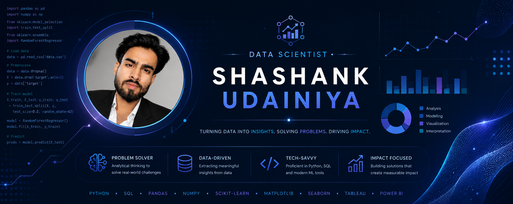

 <h1 align="center">Hi 👋, I'm Shashank Udainiya</h1>
<h3 align="center">A passionate data scientist from India</h3>

- 🌱 I’m currently learning **B.tech CS**

- 👨‍💻 All of my projects are available at [www.linkedin.com/in/ shashank-udainiya]
- 📫 How to reach me **shashankudainiya1982@gmail.com**

<h3 align="left">Connect with me:</h3>

40<h3 align="left">Languages and Tools:</h3>

           

